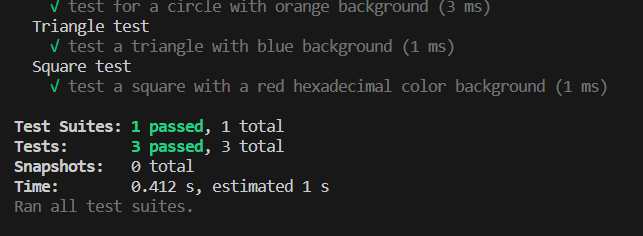

# SVG-Art

## Description

As a freelance web developer, my motivation behind this project was to create a logo generator that enables me to design unique logos for my web projects without the ongoing expense of hiring a graphic designer. I built this tool to efficiently address the frequent need for logos in my work, allowing me to streamline my workflow and focus on core web development tasks. I gained a deeper understanding of SVG manipulation and user interaction through the Inquirer package, which improved my coding skills and project management abilities. This tool not only saves money but also equips me with a valuable skill set, enhancing my self-reliance, creativity, and efficiency in my freelance work.

## Installation

1) Clone the repo by doing the following: git clone git@github.com:JosueHernand/SVG-Art.git
2) Open repo in your code editor
3) You'll need nodejs too: https://nodejs.org/en/download/current
4) Inside termial you will type the following: npm i
    to install all packages required to run the application.

## Usage

This is a logo design process, saving time and costs while fostering creativity and self-sufficiency.

To view a small quick demo [Click Here](https://drive.google.com/file/d/16VEZwN87DgDLgB9hhEqRTdh_AayWCe3J/view)

## Credits

N/A

## License

Used MIT License
